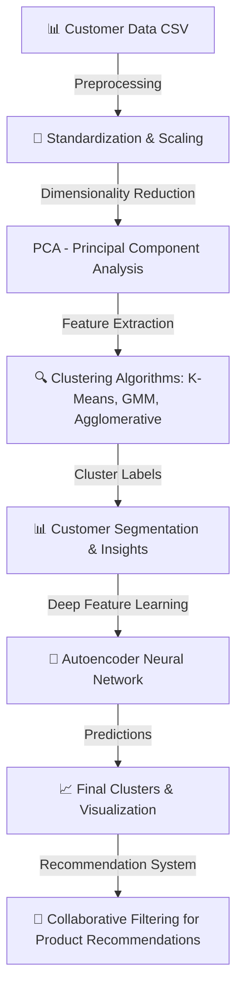

# 🎯 Customer Segmentation & Product Recommendation Using Clustering & Deep Learning

---

## 🚀 Project Overview

This project focuses on **customer segmentation and personalized product recommendation** by utilizing a combination of clustering algorithms, deep learning models, and collaborative filtering techniques. The objective is to group customers based on their purchasing behavior and provide tailored recommendations to improve user experience and business revenue.

> ✨ **Why This Project?**
> - Enables businesses to **identify distinct customer segments**.
> - Enhances **targeted marketing strategies** and product suggestions.
> - Provides a **data-driven approach to understand customer behavior**.

---

## 🔥 System Architecture Diagram

---

## ✨ Implementation Details

### **1️⃣ Outlier Detection Using Local Outlier Factor (LOF)**
- Identified **outliers in customer purchase behavior** using **LOF anomaly detection**.
- **Red dots** represent outliers detected in the dataset.

📸 **Screenshot:**

### **2️⃣ Dimensionality Reduction with PCA**
- **Applied PCA (Principal Component Analysis)** to **reduce feature dimensionality**.
- **Retained the most significant variance** while minimizing computational complexity.

📸 **Screenshot:**

### **3️⃣ Clustering Algorithms for Customer Segmentation**
Implemented **three clustering techniques**:
- **K-Means Clustering** – Efficiently segments customers into distinct groups.
- **Gaussian Mixture Model (GMM)** – A probabilistic clustering approach for better flexibility.
- **Agglomerative Hierarchical Clustering** – Provides a hierarchical view of customer similarities.

📸 **Screenshot:**

### **4️⃣ Deep Learning with Autoencoder for Feature Extraction**
- Used an **Autoencoder neural network** to learn high-dimensional customer features.
- Applied clustering on the **latent space representation** extracted from the autoencoder.

📸 **Screenshot:**

### **5️⃣ Evaluation of Clustering Models**
- Compared different clustering techniques using:
  - **Silhouette Score**
  - **Calinski Harabasz Score**
  - **Davies Bouldin Score**

📸 **Screenshot:**

### **6️⃣ RFM Analysis for Customer Segmentation**
- Implemented **Recency, Frequency, Monetary (RFM) analysis** to group customers based on shopping habits.
- Used RFM clusters to define **marketing strategies**.

📸 **Screenshot:**

### **7️⃣ Spending Trend Analysis**
- Compared **customer spending behavior** across different clusters.
- Identified trends in **purchase frequency and total expenditure**.

📸 **Screenshot:**

### **8️⃣ Customer Behavior Analysis**
- Analyzed customer engagement and purchasing habits.
- Determined factors influencing **customer retention & loyalty**.

📸 **Screenshot:**

### **9️⃣ Personalized Product Recommendation System**
- **Used collaborative filtering** to recommend products to customers.
- Applied **cosine similarity** to find **similar customers and suggest relevant products**.
- If **fewer than 3 recommendations** were found, fallback to **cluster-based recommendations**.

📸 **Screenshot:**

---

## 📌 Project Scope

### ✅ **In-Scope:**
✔️ **Customer segmentation using clustering techniques.**  
✔️ **PCA for feature reduction & visualization.**  
✔️ **Autoencoder-based deep learning for feature extraction.**  
✔️ **Evaluation of clustering performance using various metrics.**  
✔️ **Personalized product recommendation system using collaborative filtering.**  

### ❌ **Out-of-Scope:**
❌ **Predicting customer churn rates.**  
❌ **Real-time dynamic clustering (batch-based analysis only).**  
❌ **Sentiment analysis (focuses only on numerical purchase data).**  

---

## 🛠️ Tech Stack

| Clustering Algorithms | Deep Learning | Tools & Libraries | Visualization |
|-----------------|----------------|------------------|---------|
| K-Means | Keras Autoencoder | Scikit-learn | Seaborn |
| Gaussian Mixture Model (GMM) | TensorFlow | NumPy | Matplotlib |
| Agglomerative Clustering | Cosine Similarity for Recommendations | Pandas | Plotly |
| Isolation Forest (Outlier Detection) | Collaborative Filtering | Yellowbrick | Gridspec |

---

## 👥 Contributors

- [Suyash Khare]
- [Your Team Member Names]

---

## 📜 License

This project is licensed under the [MIT License](https://opensource.org/licenses/MIT). Feel free to use, modify, and distribute the code for both non-commercial and commercial purposes with proper attribution.

---

## 📞 Contact & Contribution

🤝 Want to contribute? Fork the repo and submit a PR!  
📩 **Contact:** [suyashkhareji@gmail.com](mailto:suyashkhareji@gmail.com)  
🚀 **GitHub Repository:** [Customer Segmentation & Recommendation](https://github.com/your-github-username/customer-segmentation)

---

Now, your **Customer Segmentation & Recommendation System** has a **detailed, structured, and visually enhanced `README.md`** with **screenshots and deep insights into model evaluation!** 🚀🔥 Let me know if you need further refinements! 😊
